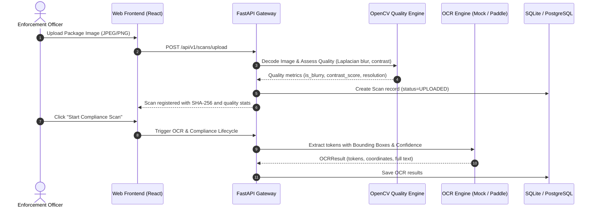
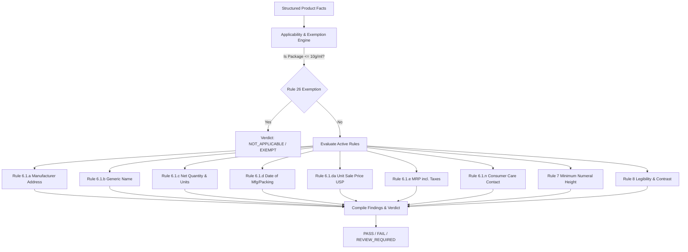

# System Architecture: Legal Metrology Packaged Commodity Compliance Platform

## 1. Architectural Philosophy

The architecture strictly enforces separation of concerns between:
1. **Perception**: Extracting text, bounding boxes, confidences, and visual dimensions from the package image.
2. **Fact Representation**: Normalizing extracted data into typed Pydantic models (e.g. INR currency, metric units).
3. **Legal Reasoning**: Evaluating deterministic statutory rules from the Legal Metrology (Packaged Commodities) Rules, 2011 against the normalized facts.
4. **Evidence & Audit**: Providing bounding boxes, crops, confidence scores, and legal citations for every finding.

## 2. Ingestion & Perception Flow

## 3. Legal Reasoning Pipeline

## 4. Modularity and Fallback Guarantees
- If physical millimeter scale cannot be verified from a 2D image, Rule 7 automatically returns `REVIEW_REQUIRED` rather than generating a false legal conviction.
- If an image is excessively blurry, OpenCV Laplacian check alerts the officer before making a legal decision.
- Pluggable OCR interface allows swapping between Mock, PaddleOCR, and Tesseract without modifying the legal rule engine.
